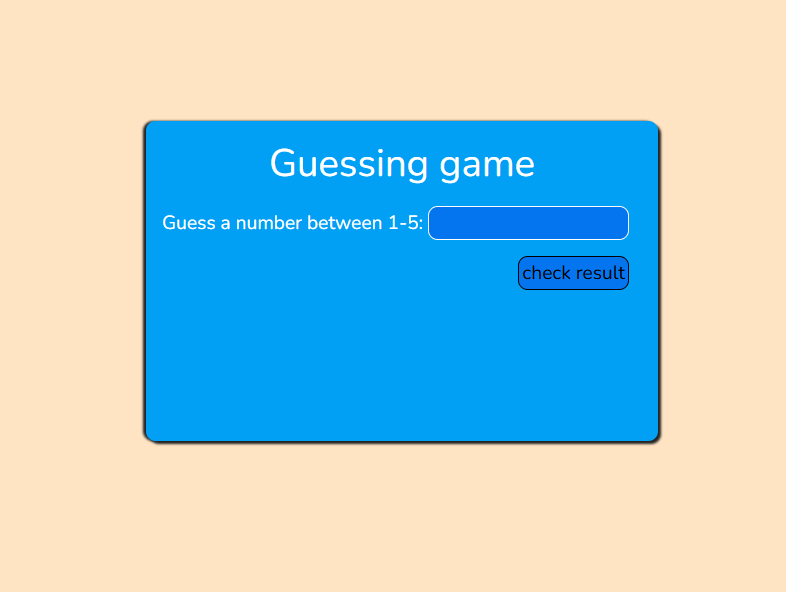

# Number Guessing Game

This is a simple number guessing game built with HTML, CSS, and JavaScript. Users can input a number between 1 and 5, and the game provides feedback on whether the guess is correct, as well as tracking the number of wins.

## Features

- **Number Guessing**: Users input a number from 1 to 5 and attempt to guess the correct number.
- **Feedback on Guess**: Shows whether the guess was correct or incorrect.
- **Win Counter**: Tracks the number of times the user guesses correctly.
- **User-Friendly Interface**: Simple and responsive design.

## Technologies Used

- **HTML**: Structure for the game layout.
- **CSS**: Styling for the input, button, and feedback display.
- **JavaScript**: Logic for generating random numbers, handling user input, and counting wins.

